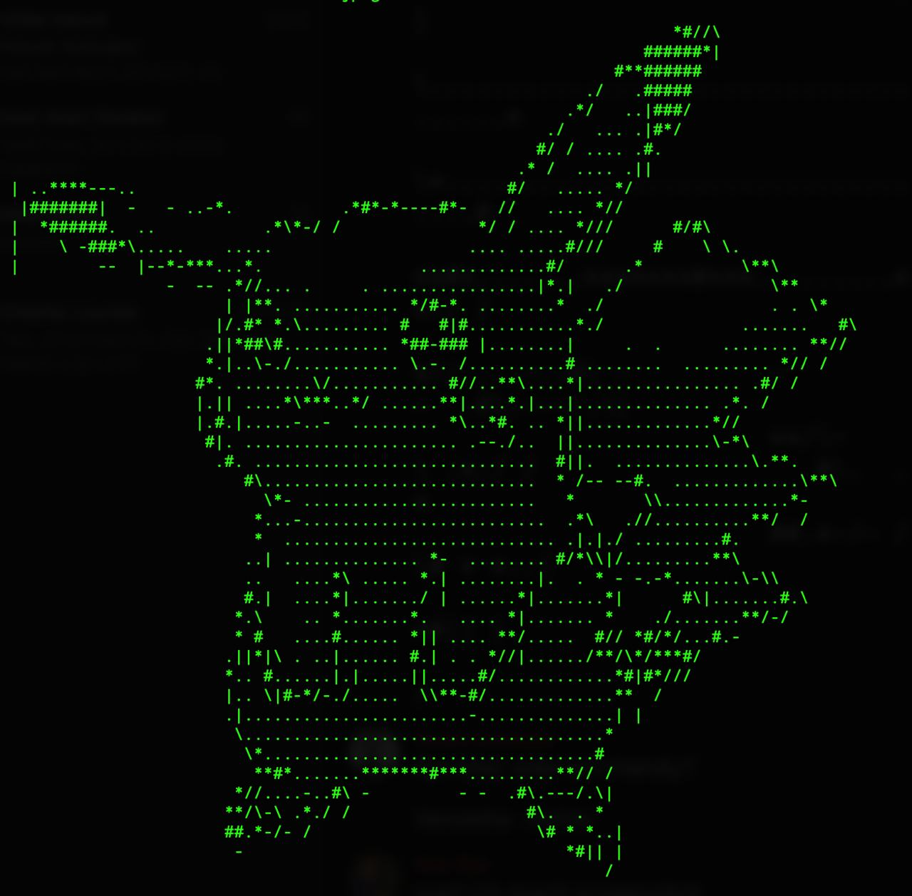

# Charify
tunrs pixels graphics into characters

Images are read using [stb_image](https://github.com/nothings/stb/blob/master/stb_image.h). Pixel brightnes is used mapped onto characters ' .*#'. Edges are detected using the [sobel filter](https://de.wikipedia.org/wiki/Sobel-Operator) and are represented by '|\-/'.

#Todos:
- Implement GUI using OpenGL and ImGUI
- Better image decimation
- command line programm
